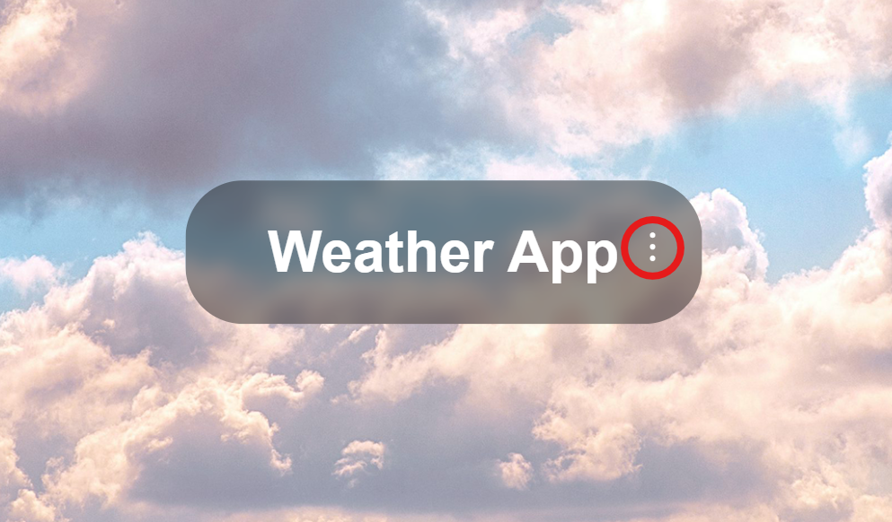

      

This is a weather program that displays details of a specific city in the world using texts, icons, and corresponding backgrounds.

## Installation

Try-out the website with this [link](https://francogabrieloliveros.github.io/weather_program/):

    https://francogabrieloliveros.github.io/weather_program/

or clone the repository

    git clone https://github.com/francogabrieloliveros/weather_program.git

## Usage

In the homepage, click the triple-dot icon to open the search-bar. Type in any city in the world and wait for the weather information to display.

The same principle applies when a weather info is already displayed.

## Additional Notes and Features

I just made this website to learn JavaScript, CSS, and HTML. I'm pretty sure its a cannon event for programmers to make a weather app at some point. Also, I wanted to try making a readme file for the repository as I've seen some repos do the same, hence this.

Moreover, I thought it would be fun to stray away from what tutorials offer and I added these features:

- Background changing depending on the weather.
- Slidable forecasts (got the idea from a tutorial).
- Blur aesthetic.
- Toggleable search bar.
- My own icons.
